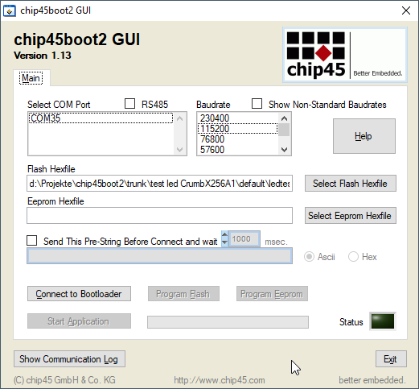

# chip45boot2
Bootloader for Atmel AVR ATmega and Xmega micro controllers with Intel hex file support and automatic baudrate adjustment. 

chip45boot2 was previously offered commercially by chip45.com and is now available as open-source under MIT License.

## Description

Flexible bootloader for AVR microcontrollers with auto-baud, hexfile support and extra functions. See [infosheet](docs/chip45boot2_infosheet.pdf) for details.

## Features
chip45boot2 provides the following features:

- direct input of Intel Hex files
- automatic baud rate adjustment
- XON/XOFF protocol
- Flash and EEPROM programming
- byte-wise writing and reading of SRAM memory
- byte-wise writing and reading of EEPROM memory
- 2k bootblock size
- graphical Windows user interface chip45boot2 GUI for programming from PC
- The bootloader automatically adjusts at start to the hosts baudrate, so that it is not necessary to recompile the bootloader to a particular MCU clock.

## Further Information

- [chip45boot2 Infosheet](docs/chip45boot2_infosheet.pdf)
- [Notes for using Atmel Studio](docs/chip45boot2_Studio6_notes.pdf)

## PC Software
The chip45boot2 GUI is a PC/Windows application with a graphical user interface for the bootloader, which simplifies flash and eeprom programming over a COM port.

You can download Windows binaries under [releases](https://github.com/eriklins/chip45boot2/releases).

The PC software was programmed with LabWindows/CVI and hence requires an active license for that.

## Command Line Tool
[c45b](https://github.com/bullestock/c45b) is a command line frontend for the bootloader.

## Pre-Compiled Hex Files
Pre-built bootloader hexfiles for a bunch of AVR MCUs are included under [bootloader/build](bootloader/build).

## Contributing/Feedback
Feedback / improvements / pull-requests / etc. are welcome. 

However, I decided to open-source the bootloader due to lack of time/resources available for supporting the bootloader anymore, hence I cannot guarantee working on issues/pull-requests in the short-term.

## License
Copyright (C) 2023 Erik Lins

This project is released under the MIT License.
